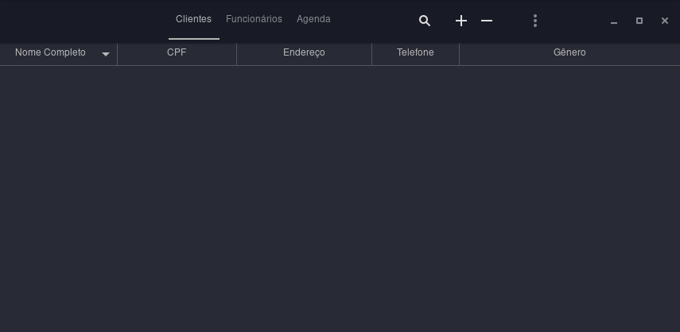

# Software-para-Barbearia

<b>Gerenciamento de Clientes, Funcionários e Agenda.</b>>

 -> Escrito em C e GTK3 para Linux/Mac/Windows

  

Flag para compilar (GCC-Linux): gcc -o Cabeleireiro main.c -Wall -rdynamic $(pkg-config --cflags --libs gtk+-3.0) -export-dynamic 

