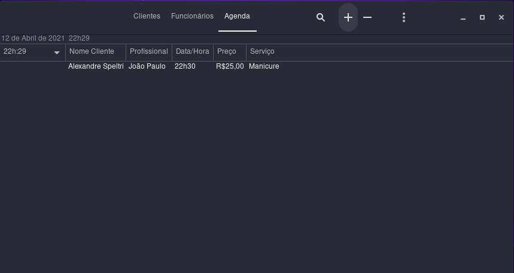

# Software-para-Barbearia

#Gerenciamento de Clientes, Funcionários e Agenda.

 Escrito em C e GTK3 para Linux/Mac/Windows

Flag para compilar (GCC-Linux): gcc -o Cabeleireiro main.c -Wall -rdynamic $(pkg-config --cflags --libs gtk+-3.0) -export-dynamic

